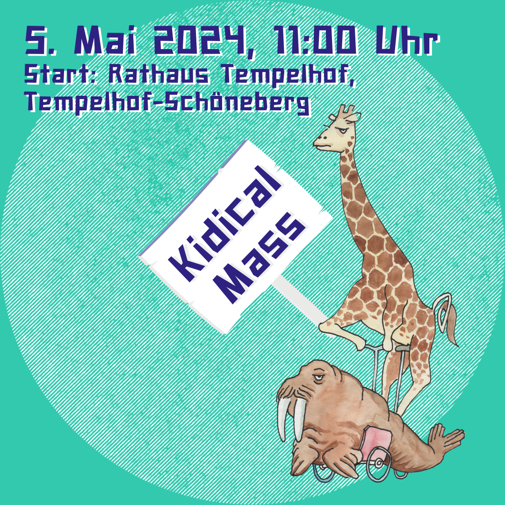

# Kidical Mass 05.05.2024

🚴‍♂️🌟 Seid dabei, wenn wir gemeinsam die Straßen erobern! 🌟🚴‍♀️ Am 5. Mai 2024 veranstalten die ADFC Stadtteilgruppe Tempelhof und das Fahrradfreundliche Netzwerk Tempelhof-Schöneberg eine Kidical Mass! 🎉 Von 11 bis 13:30 Uhr heißt es: Kinder-Fahrraddemo in Tempelhof! 🌈🚲 Lasst uns gemeinsam ein Zeichen setzen für mehr Sicherheit und Spaß auf unseren Straßen! 💪😊

Wir werden diese [Route](https://bikerouter.de/#map=16/52.4697/13.3726/osm-mapnik-german_style&lonlats=13.385414,52.463636;13.384427,52.459367;13.384561,52.459353;13.386068,52.483232;13.388193,52.484468;13.385983,52.484926;13.385875,52.48439;13.378322,52.478439;13.378322,52.477619;13.37697,52.476978;13.377893,52.468656;13.374213,52.468617;13.36813,52.47192;13.359954,52.475418;13.359096,52.474868;13.359879,52.475307;13.367057,52.472436;13.37814,52.466299;13.385489,52.465697;13.385993,52.471613) fahren und enden am Tempelhofer Feld bei einem [Kinder Picknick](https://www.tagdesgutenlebens.berlin/event/kinder-picknick-spiel-spass-und-schmaus/)

Weitere Infos:
- [Netzwerk fahrradfreundliches Tempelhof-Schöneberg](https://www.rad-ts.de/was-ist-bunt-froehlich-und-riiiiiesengross-die-kidical-mass/)
- [ADFC](https://berlin.adfc.de/artikel/1-kidical-mass-in-tempelhof-in-2024)
- [Kinderaufsrad](https://kinderaufsrad.org/) Aktionsbündnis
- [Changing Cities](https://changing-cities.org/kampagnen/kidical-mass-berlin-2024/)

